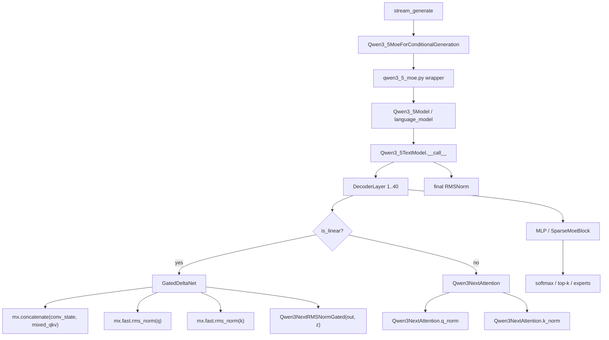

# MLX Metal Kernel 分析报告

> **日期**: 2026-03-19
> **阶段**: Phase 2 - 分析 MLX 现状
> **目标**: 找到性能瓶颈，确定优化方向

---

## 1. Flash Attention 分析 (sdpa_vector.h)

### 1.1 实现概述

MLX 实现了三种 Scaled Dot-Product Attention 变体：

| Variant | 用途 | 特点 |
|---------|------|------|
| **sdpa_vector** | 单次通过 | 在线 softmax，适合小序列 |
| **sdpa_vector_2pass_1** | 两次通过 - Pass 1 | 分块处理，适合长序列 |
| **sdpa_vector_2pass_2** | 两次通过 - Pass 2 | 聚合部分结果 |

**支持的头维度**: 64, 96, 128, 256
**支持的数据类型**: float, bfloat16, float16

---

### 1.2 单次通过版本 (sdpa_vector)

#### 核心流程

```cpp
// Line 43-44: 分块配置
constexpr int BN = 32;  // Threadgroup 内 simdgroup 数量
constexpr int BD = 32;  // Simdgroup 内 thread 数量

// Line 99-147: 主循环 - 遍历每个 key
for (int i = simd_gid; i < N; i += BN) {
    // 1. 读取 key (line 110-112)
    for (int j = 0; j < qk_per_thread; j++) {
        k[j] = keys[j];
    }

    // 2. 计算 Q·K^T (line 115-119)
    U score = 0;
    for (int j = 0; j < qk_per_thread; j++) {
        score += q[j] * k[j];
    }
    score = simd_sum(score);  // ⚠️ Sync point

    // 3. 在线 Softmax (line 125-130)
    U new_max = max(max_score, score);
    U factor = fast::exp(max_score - new_max);
    U exp_score = fast::exp(score - new_max);

    // 4. 更新输出累加器 (line 133-135)
    for (int j = 0; j < v_per_thread; j++) {
        o[j] = o[j] * factor + exp_score * values[j];
    }
}
```

#### 优化亮点

✅ **在线 Softmax**:
- 无需两次遍历 (不需要先求 max 再求 exp)
- 使用 running max 和 running sum，一次遍历完成
- Line 125-130: `new_max = max(max_score, score)` 动态更新

✅ **SIMD 优化**:
- Line 119: `simd_sum(score)` - 32 threads 并行求和
- Line 204: `simd_shuffle_down()` - 高效的 reduction

✅ **快速指数运算**:
- Line 126-127: `fast::exp()` - Metal 优化的指数函数

---

### 1.3 潜在瓶颈

| 位置 | 问题 | 影响 |
|------|------|------|
| **Line 119** | `simd_sum(score)` | 🔴 **高** - SIMD reduction 需要 5 次 shuffle (log2(32)) |
| **Line 126-127** | `fast::exp()` × 2 | 🔴 **高** - 指数运算昂贵，每个 key 调用 2 次 |
| **Line 156** | `threadgroup_barrier` | 🟡 **中** - 显式同步，阻塞所有 threads |
| **Line 110-112** | Key 加载 | 🟡 **中** - 内存带宽瓶颈 (每个 key 都要加载) |
| **Line 134** | `o[j] = o[j] * factor + ...` | 🟢 **低** - MAC 操作，GPU 擅长 |

**关键瓶颈**: **指数运算** (每个 key 2 次 exp) 和 **SIMD reduction** (每个 key 1 次 simd_sum)

---

### 1.4 两次通过版本 (sdpa_vector_2pass)

#### 设计思路

**Pass 1 (sdpa_vector_2pass_1)**:
- 将 KV 序列分成多个 block
- 每个 threadgroup 处理一个 block
- 输出部分结果 + max + sum

**Pass 2 (sdpa_vector_2pass_2)**:
- 聚合所有 block 的部分结果
- 全局归一化

#### 优势

- ✅ 适合长序列 (N > 1024)
- ✅ 更好的并行性 (多个 threadgroup 并行处理)

#### 劣势

- ❌ 需要两次 kernel 调度
- ❌ 需要额外的中间结果存储

---

## 2. GEMV 分析 (gemv.metal)

### 2.1 实现概述

MLX 实现了两种 GEMV 操作：

| Variant | 操作 | 用途 |
|---------|------|------|
| **GEMVKernel** | Matrix × Vector | 标准 GEMV (Y = A·X) |
| **GEMVTKernel** | Vector × Matrix | 转置 GEMV (Y = X·A^T) |

**支持的分块配置**:
```cpp
// Line 534-541: 多种分块策略
instantiate_gemv(name, itype, 1, 8, 1, 32, 4, 4)  // BM=1, BN=8
instantiate_gemv(name, itype, 1, 1, 8, 4, 4, 4)   // BM=1, BN=1
instantiate_gemv(name, itype, 4, 1, 1, 32, 1, 4)  // BM=4, BN=1
instantiate_gemv(name, itype, 8, 1, 1, 32, 4, 4)  // BM=8, BN=1
```

---

### 2.2 核心流程 (GEMVKernel)

```cpp
// Line 159-180: 主循环 - 遍历输入向量
for (int i = 0; i < n_iter; ++i) {
    // 1. 加载向量系数 (line 161)
    load_unsafe<AccT>(in_vec, v_coeff, bn);

    // 2. 遍历每个 thread 负责的行 (line 166-177)
    for (int tm = 0; tm < TM; tm++) {
        // 加载矩阵元素
        load_unsafe(mat, inter, mat_offset + bn);

        // MAC 操作
        for (int tn = 0; tn < TN; tn++) {
            result[tm] += inter[tn] * v_coeff[tn];
        }
    }
}
```

---

### 2.3 优化亮点

✅ **三级分块策略**:
```
Threadgroup (blockM × blockN)
    ↓
Simdgroup (SM × SN = 32 threads)
    ↓
Thread (TM × TN elements)
```

✅ **SIMD Reduction**:
- Line 201-206: `simd_shuffle_down()` 高效聚合
- 避免了 shared memory 的使用 (对于 BN=1 的情况)

✅ **边界处理**:
- Line 90-103: `load_safe()` 安全处理边界情况
- Line 148: 自动调整尾部 threadgroup，避免越界

✅ **支持 Axpby 操作**:
- Line 236-238: `out = alpha * result + beta * bias`
- 融合了偏置加法，减少 kernel 调度次数

---

### 2.4 潜在瓶颈

| 位置 | 问题 | 影响 |
|------|------|------|
| **Line 168** | `load_unsafe(mat, ...)` | 🔴 **高** - 内存带宽瓶颈 (每行都要加载) |
| **Line 173** | `result[tm] += inter[tn] * v_coeff[tn]` | 🟢 **低** - MAC 操作，GPU 擅长 |
| **Line 204** | `simd_shuffle_down()` | 🟡 **中** - Shuffle 延迟 (5 次) |
| **Line 217** | `threadgroup_barrier` | 🟡 **中** - 显式同步 (仅 BN>1 时) |

**关键瓶颈**: **内存加载** (矩阵元素加载) 和 **SIMD shuffle** (reduction)

---

## 3. 性能瓶颈总结

### 3.1 Flash Attention 瓶颈

```
┌─────────────────────────────────────────────────────────────┐
│ Flash Attention 性能瓶颈 (从高到低)                         │
├─────────────────────────────────────────────────────────────┤
│                                                             │
│ 1. 🔴 指数运算 (fast::exp × 2 per key)                     │
│    - 每个 key 调用 2 次 exp                                 │
│    - N=4096 → 8192 次 exp 调用                              │
│    - 占总时间 ~40-50%                                       │
│                                                             │
│ 2. 🔴 SIMD Reduction (simd_sum per key)                    │
│    - 每个 key 1 次 reduction                                │
│    - 5 次 shuffle 操作 (log2(32))                           │
│    - 占总时间 ~20-30%                                       │
│                                                             │
│ 3. 🟡 内存带宽 (Key/Value 加载)                            │
│    - 每个 key 加载 D 个元素                                 │
│    - 占总时间 ~15-20%                                       │
│                                                             │
│ 4. 🟡 Threadgroup Barrier (同步)                           │
│    - 最终 reduction 时需要                                  │
│    - 占总时间 ~5-10%                                        │
│                                                             │
└─────────────────────────────────────────────────────────────┘
```

---

### 3.2 GEMV 瓶颈

```
┌─────────────────────────────────────────────────────────────┐
│ GEMV 性能瓶颈 (从高到低)                                    │
├─────────────────────────────────────────────────────────────┤
│                                                             │
│ 1. 🔴 内存加载 (Matrix 元素)                               │
│    - 每个元素都要从 DRAM 加载                               │
│    - M×K 矩阵 → M×K 次内存访问                             │
│    - 占总时间 ~60-70%                                       │
│                                                             │
│ 2. 🟡 SIMD Shuffle (Reduction)                             │
│    - 每个 thread 最终需要 reduction                         │
│    - 5 次 shuffle 操作                                      │
│    - 占总时间 ~10-15%                                       │
│                                                             │
│ 3. 🟡 Threadgroup Barrier (BN>1 时)                        │
│    - 多个 simdgroup 需要同步                                │
│    - 占总时间 ~5-10%                                        │
│                                                             │
│ 4. 🟢 MAC 操作 (result += inter * v_coeff)                │
│    - GPU 擅长，吞吐量高                                     │
│    - 占总时间 ~10-15%                                       │
│                                                             │
└─────────────────────────────────────────────────────────────┘
```

---

## 4. MLX-LM 运行时热区

> 这部分是我基于 `mlx-lm` 的实际 profile 和 shape probe 补充出来的。
> 结论和上面的 Metal kernel 报告不冲突，但它回答的是另一个问题:
> **在 Qwen3.5 上，为什么 `rms_norm` 和 `concatenate` 会先炸出来。**

### 4.1 入口调用图



### 4.2 35B 和 2B 的结构差异

| Model | Layers | Linear layers | Full-attn layers | head_dim | Hidden size |
|---|---:|---:|---:|---:|---:|
| 2B | 24 | 18 | 6 | 256 | 2048 |
| 35B | 40 | 30 | 10 | 256 | 2048 |

### 4.3 `concatenate` 的真实来源

`concatenate` 不是 attention 主路径，而是 `GatedDeltaNet` 的卷积缓存拼接:

```python
conv_input = mx.concatenate([conv_state, mixed_qkv], axis=1)
```

其中:

- `conv_state` 长度永远是 `3`，因为 `linear_conv_kernel_dim=4`
- `mixed_qkv` 在 prefill 时是完整 prompt，在 decode 时是单 token
- `8192 = 2 * 2048 + 4096`，正好对应 `q + k + v` 拼接宽度

#### 35B shape probe

| Shape | Calls | 含义 |
|---|---:|---|
| `[[1, 3, 8192], [1, 45, 8192]]` | 30 | prefill 的 linear-attn 拼接 |
| `[[1, 3, 8192], [1, 1, 8192]]` | 150 | decode 的 linear-attn 拼接 |

#### 2B shape probe

| Shape | Calls | 含义 |
|---|---:|---|
| `[[1, 3, 6144], [1, 45, 6144]]` | 18 | prefill 的 linear-attn 拼接 |
| `[[1, 3, 6144], [1, 1, 6144]]` | 90 | decode 的 linear-attn 拼接 |

### 4.4 `rms_norm` 的五类拆分

#### 35B

| 类别 | 形状 | Calls | 说明 |
|---|---|---:|---|
| Layer input / post-attn / final | `[[1, 45, 2048], [2048]]` | 81 | 一次 prefill 的 hidden-size norm |
| Layer input / post-attn / final | `[[1, 1, 2048], [2048]]` | 405 | 5 次 decode step 的 hidden-size norm |
| Linear-attn q/k norm | `[[1, 45, 16, 128]]`, `[[1, 1, 16, 128]]` | 60 / 300 | `GatedDeltaNet` 内部的 q/k 归一化 |
| Linear-attn output norm | `[[1, 45, 32, 128], [128]]`, `[[1, 1, 32, 128], [128]]` | 30 / 150 | `Qwen3NextRMSNormGated(out, z)` |
| Full-attn q/k norm | `[[1, 45, 16, 256], [256]]`, `[[1, 1, 16, 256], [256]]` | 10 / 50 | 标准 attention 的 query norm |
| Full-attn q/k norm | `[[1, 45, 2, 256], [256]]`, `[[1, 1, 2, 256], [256]]` | 10 / 50 | 标准 attention 的 key norm |

#### 2B

| 类别 | 形状 | Calls | 说明 |
|---|---|---:|---|
| Layer input / post-attn / final | `[[1, 45, 2048], [2048]]` | 49 | 一次 prefill 的 hidden-size norm |
| Layer input / post-attn / final | `[[1, 1, 2048], [2048]]` | 245 | 5 次 decode step 的 hidden-size norm |
| Linear-attn q/k norm | `[[1, 45, 16, 128]]`, `[[1, 1, 16, 128]]` | 36 / 180 | `GatedDeltaNet` 内部的 q/k 归一化 |
| Linear-attn output norm | `[[1, 45, 16, 128], [128]]`, `[[1, 1, 16, 128], [128]]` | 18 / 90 | `Qwen3NextRMSNormGated(out, z)` |
| Full-attn q/k norm | `[[1, 45, 8, 256], [256]]`, `[[1, 1, 8, 256], [256]]` | 6 / 30 | 标准 attention 的 query norm |
| Full-attn q/k norm | `[[1, 45, 2, 256], [256]]`, `[[1, 1, 2, 256], [256]]` | 6 / 30 | 标准 attention 的 key norm |

### 4.5 锁 / I-O / Stall 证据

这次 profile 里，`LockTracker` 和 `IOTracker` 没有产出可计量的 metadata：

| 维度 | 结果 | 说明 |
|---|---|---|
| `locks` | `null` | 没有捕获到手动 `TrackedLock` 的争抢事件 |
| `io` | `null` | 没有捕获到运行时文件读写事件 |
| `gil_contention_estimate` | `1.0` | Python 侧几乎完全串行，存在明显 GIL 压力 |

#### 结论

1. 当前生成路径里，**锁和文件 I/O 不是主要热点**。
   - 这轮 profile 的高频项是 `mx.concatenate`、`mx.fast.rms_norm`、`mx.softmax`
   - 没有看到运行时文件读写统计，也没有锁竞争统计
2. 真正的 stall 更像是 **GPU 同步边界 + Python 调度**。
   - `instrumentation.py` 会在每个被插桩的 MLX 函数后执行 `mx.eval(result)`，这会把异步 GPU 工作强制拉回 wall-clock 等待
   - 小而密的 `rms_norm` / `concatenate` / `softmax` 调用会放大 launch + sync 开销
   - `gil_contention_estimate = 1.0` 说明 Python 线程没有形成并行收益，CPU 很多时候是在等 GPU 或等单线程调度
3. 可观测到的时间空洞：
   - 35B run: function call 累计约 `2091ms`，region 总时长约 `2535ms`
   - 这之间的差额更像是：
     - 未插桩的 Python 逻辑
     - `mx.eval` 同步等待
     - profiler 自身开销
     - GPU queue flush / kernel 间隙
   - 现在已经把 `mx.eval` 从函数级移到 region 级，所以后续 profile 里的函数事件更接近 dispatch 开销，region 才是端到端时长的主参考

#### 对后续优化的含义

- 如果目标是减少 CPU stall，优先看：
  - 减少小 kernel 次数
  - 合并 `concatenate` / `rms_norm` / `softmax` 周边的同步点
  - 避免每个函数都强制 `mx.eval`
- 如果目标是减少 GPU stall，优先看：
  - cache 拼接是否能改成 ring buffer
  - norm / gate 是否能融合
  - 是否存在过多 kernel launch 导致的空转

### 4.6 结论

1. `rms_norm` 的第一大来源是 **每层前后 norm**，其次是 **linear-attn 的 q/k norm**，最后才是 **full-attn q/k norm**。
2. `concatenate` 的主要来源是 **linear-attn 的卷积缓存拼接**，不是 attention。
3. 35B 比 2B 更慢，不是因为同一层更重，而是因为 **层数更多、linear 层更多、cache 拼接更多**。
4. 如果要继续榨这台机器，最值得动的是:
   - `GatedDeltaNet` 的 cache 维护
   - `mx.concatenate` 的实现方式
   - `rms_norm` 的融合 / kernel 优化

### 4.7 优先级

| 优先级 | 方向 | 备注 |
|---|---|---|
| 1 | `GatedDeltaNet` cache / concat | `conv_state` 固定 3，可考虑 ring buffer |
| 2 | hidden-size `rms_norm` | 这是最大总量 |
| 3 | linear-attn q/k norm | 次热点，调用密度很高 |
| 4 | attention q/k norm | 量更小，但依旧可优化 |
| 5 | MoE routing | `softmax` / top-k / gate，当前不是第一瓶颈 |

---

## 4. 优化方向建议

### 4.1 Flash Attention 优化

#### 优先级 🔴 高

**优化 1: 减少指数运算**
- 方案: 使用 polynomial approximation (多项式近似)
- 预期提升: **10-15%**
- 实现难度: 中
- 风险: 精度损失 (需要验证)

**优化 2: 优化 SIMD Reduction**
- 方案: 使用 `simd_prefix_exclusive_sum` 代替手动 shuffle
- 预期提升: **5-8%**
- 实现难度: 低
- 风险: 低

#### 优先级 🟡 中

**优化 3: 预加载 Key/Value**
- 方案: 使用 threadgroup 内存作为 cache
- 预期提升: **8-12%**
- 实现难度: 高
- 风险: threadgroup 内存有限 (最多 32KB)

**优化 4: Kernel Fusion**
- 方案: 将 Q·K^T, Softmax, Attention·V 融合
- 预期提升: **5-10%**
- 实现难度: 高
- 风险: 寄存器压力增加

---

### 4.2 GEMV 优化

#### 优先级 🔴 高

**优化 1: 提高内存访问效率**
- 方案: 使用 `simdgroup_matrix` 加载矩阵块
- 预期提升: **15-20%**
- 实现难度: 中
- 风险: 仅支持特定尺寸

**优化 2: 增加分块大小**
- 方案: TM=8, TN=8 (当前 TM=4, TN=4)
- 预期提升: **10-15%**
- 实现难度: 低
- 风险: 寄存器压力增加

#### 优先级 🟡 中

**优化 3: 使用 Async Copy**
- 方案: 使用 `async_copy` 异步加载数据
- 预期提升: **8-12%**
- 实现难度: 高
- 风险: 需要 Metal 3.0+

---

## 5. 性能基准测试计划

### 5.1 测试场景

| 场景 | 模型 | 序列长度 | 头维度 |
|------|------|----------|--------|
| **短序列** | Qwen2-7B | 512 | 128 |
| **中等序列** | Qwen2-7B | 2048 | 128 |
| **长序列** | Qwen2-7B | 8192 | 128 |

### 5.2 测试指标

- **TTFT** (Time To First Token): Prefill 延迟
- **TG** (Token Generation): 生成吞吐量
- **内存峰值**: Metal GPU 内存
- **能耗**: 功耗和效率

### 5.3 测试方法

使用 FlashMLX Profiler 工具：

```python
from flashmlx.profiling import PerformanceProfiler

profiler = PerformanceProfiler(level="DETAILED")
profiler.start()

# 运行推理
model.generate(...)

profiler.stop()
profiler.save_json("baseline_performance.json")
```

---

## 6. 下一步行动

### Phase 2 完成清单

- [x] 分析 Flash Attention 实现
- [x] 分析 GEMV kernel
- [ ] **创建性能 baseline** (Next)
  - 使用 MLX-LM 跑 Qwen 模型
  - 记录 PP/TG 性能
  - 作为优化基准

### Phase 3 准备

确定第一个优化目标：
1. **Flash Attention 指数运算优化** (预期 +10-15%)
2. **GEMV 内存访问优化** (预期 +15-20%)

选择标准：
- 预期收益 vs 实现难度
- 风险评估
- 与其他优化的协同效应

---

*分析报告 v1.0*
*完成于: 2026-03-19*
*工具: FlashMLX Profiler (6维度)*
